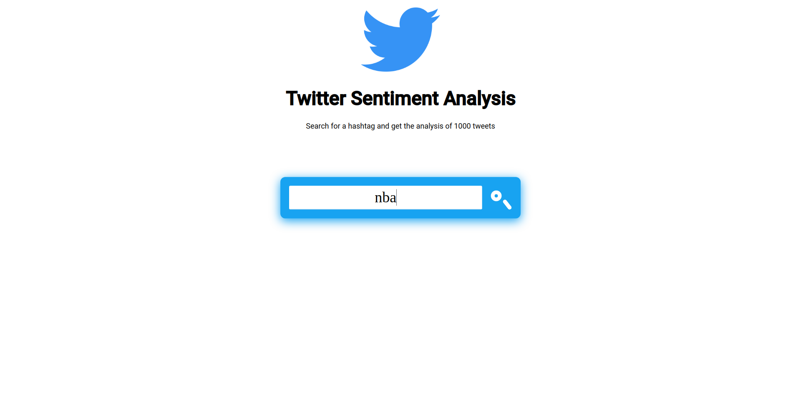
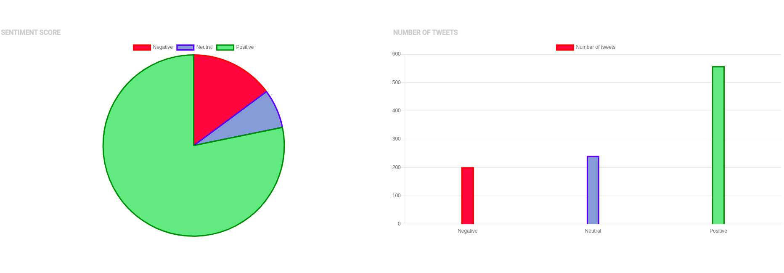
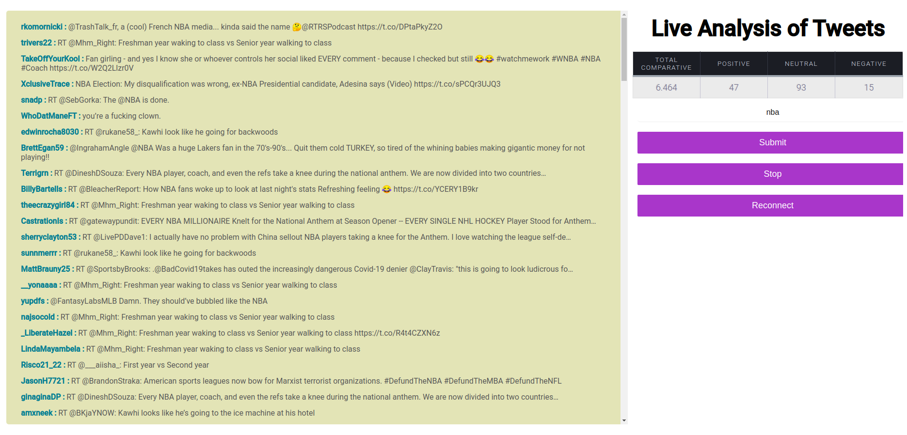

# Twitter Sentiment Analysis Full Stack Web App Using MEAN Stack

# Backend
`cd backend/`  
Configure the .env file based on the sample_env file in backend/ dir  
`node index.js`  

# Frontend

`cd frontend/`  

This project was generated with [Angular CLI](https://github.com/angular/angular-cli) version 8.3.23.

## Development server

Run `ng serve` for a dev server. Navigate to `http://localhost:4200/`. The app will automatically reload if you change any of the source files.

